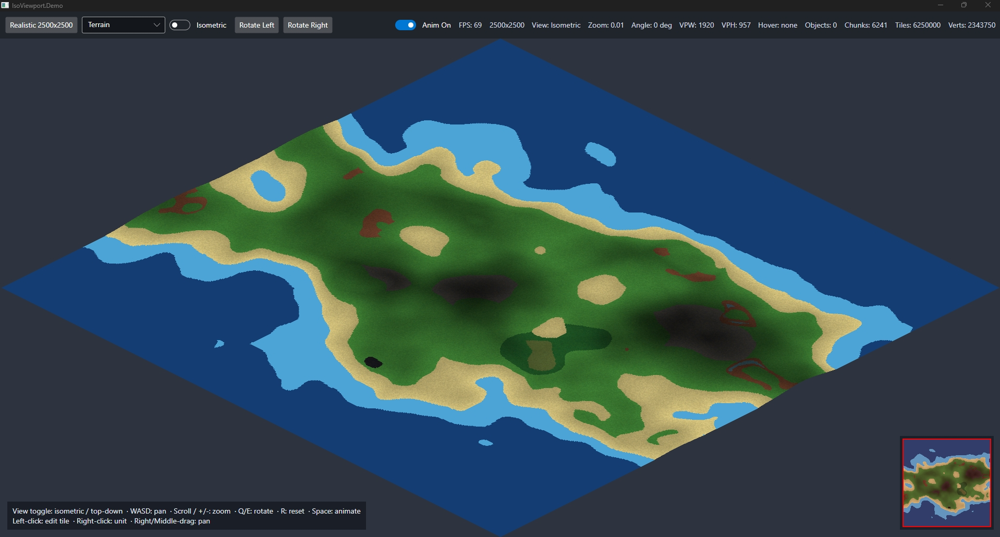
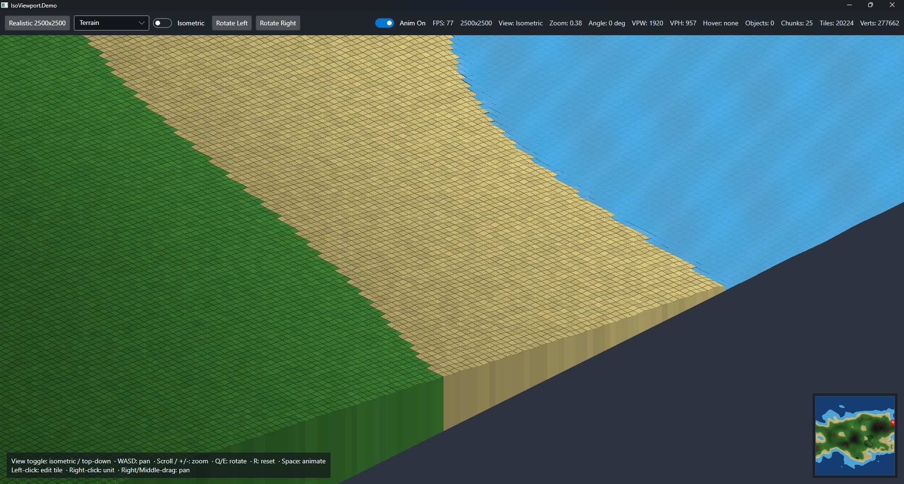
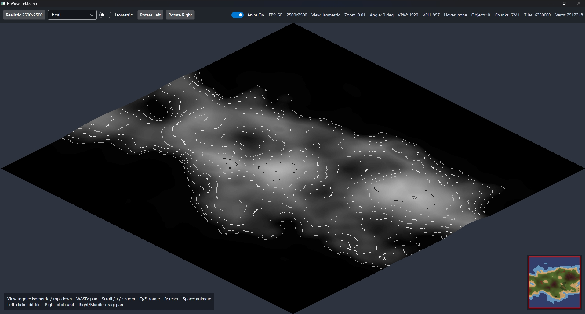
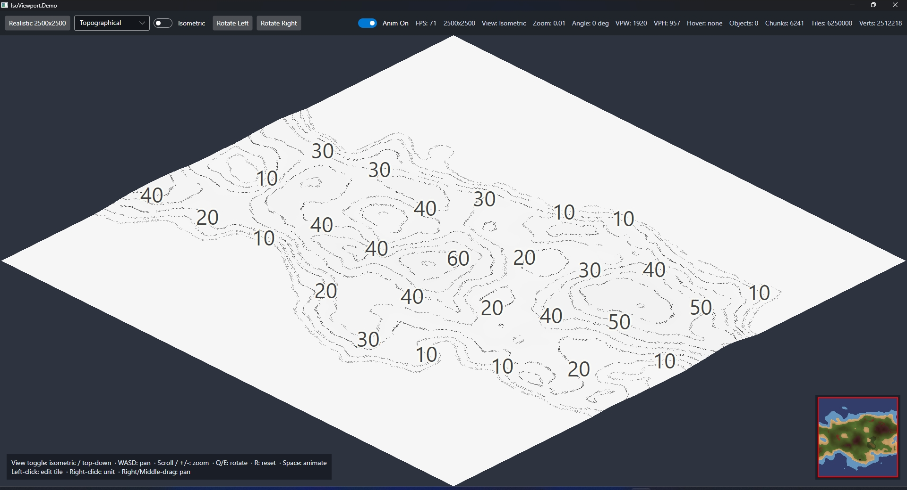

> Note
> This project was vibe coded, so I can't take credit for writing the code itself. My contribution was in defining the requirements, steering the iteration, and testing the results.
>
> I run and test this on an NVIDIA GeForce RTX 4090 with 16 GB of VRAM, so your mileage may vary on different hardware.
# IsoViewport

`IsoViewport` is a .NET 10 / Avalonia 12 terrain viewer focused on large tile maps, isometric rendering, and smooth camera interaction.

It currently includes:

- isometric and top-down projection modes
- terrain, heat-map, and topographical render modes
- chunked OpenGL terrain rendering via `Silk.NET.OpenGL`
- animated deep/shallow water rendering
- minimap, tile picking, camera pan / zoom / rotation, and hover support
- large-map performance work including far-zoom LOD rendering
- an Avalonia demo app and xUnit coverage for core math, batching, overlays, and view-model behavior

## Screenshots

### Terrain



### Terrain Close-Up



### Heat Map



### Topographical



## Solution Layout

- `IsoViewport.Controls`
  Rendering control library with the terrain renderer, overlays, batching, camera math, map types, and helpers.

- `IsoViewport.Demo`
  Desktop demo app for exercising the viewer, presets, render modes, and debug stats.

- `IsoViewport.Tests`
  xUnit coverage for renderer math, chunking, batching, colors, overlays, and demo view-model logic.

## Requirements

- .NET 10 SDK
- Windows desktop environment for the Avalonia demo
- GPU / driver support for the Avalonia OpenGL control path

## Run

```powershell
dotnet restore IsoViewport.sln --configfile NuGet.Config
dotnet build IsoViewport.sln --no-restore
dotnet run --project IsoViewport.Demo\IsoViewport.Demo.csproj --no-build
```

Run tests:

```powershell
dotnet test IsoViewport.Tests\IsoViewport.Tests.csproj
```

## Demo Controls

- `WASD` / arrow keys: pan
- `Q` / `E`: rotate view
- mouse wheel / `+` / `-`: zoom
- `R`: reset camera
- `Space`: toggle animation
- left click: cycle tile type
- right click: toggle a unit on the tile
- right drag or middle drag: pan

## Notes

- The repo currently targets a preview .NET 10 SDK, so `NETSDK1057` warnings are expected.
- Avalonia currently pulls in a transitive advisory warning for `Tmds.DBus.Protocol` in this environment.
